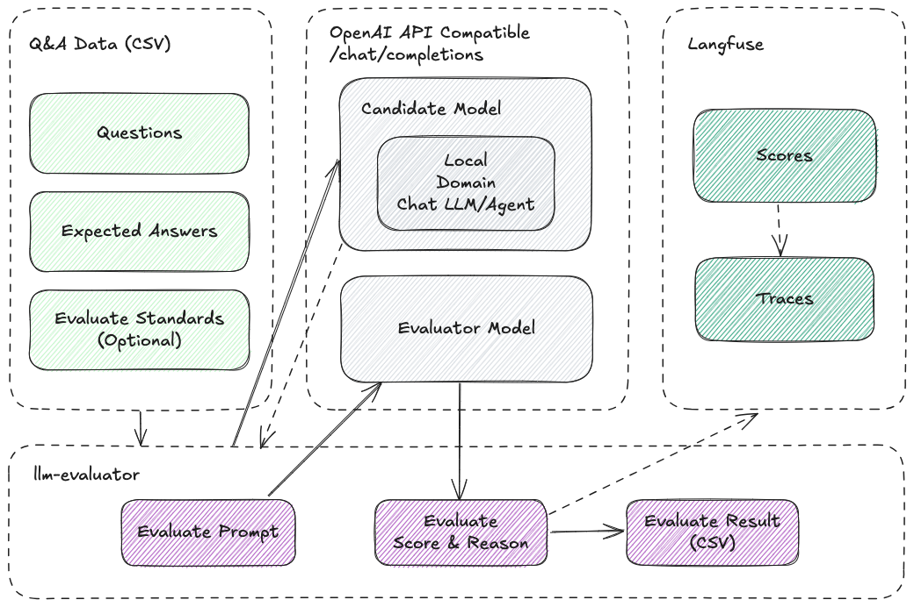
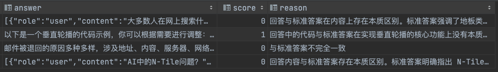
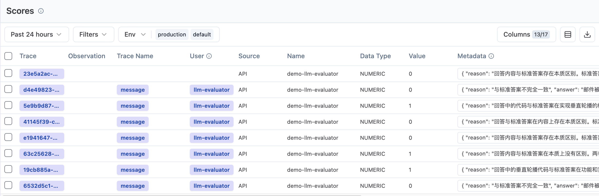
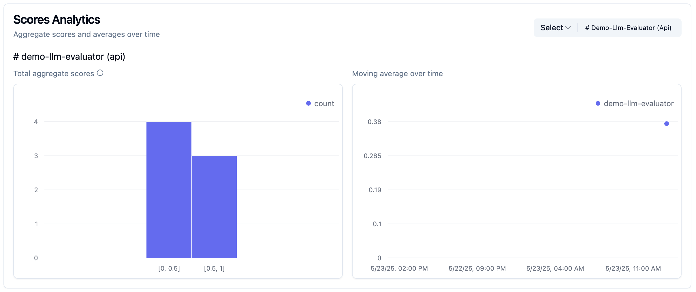

LLM Evaluator
=============



LLM Evaluator 是一个跨平台的命令行工具，旨在帮助用户评估基于兼容 OpenAI API 对话补全接口的大语言模型（或智能体、RAG 流程）对于有标准答案的问题的回答能力。

流程
----

基本工作流程为：

1. `llm-evaluator` 通过配置文件读取待评估的问题及标准答案，评估标准可选，默认为本质含义一致，可设置为 `=` 表示必须与标准答案完全一致；
2. 调用候选模型对话补全接口，获得候选模型对待评估问题的回答；
3. 使用评估提示词组装问题、标准答案和候选模型回答的内容，交由评估模型对回答进行评估；
4. 评估结果输出至 CSV 文件中，并可选同步至 [Langfuse](https://langfuse.com/) 平台以便可视化观察及对比多次评估结果。

特点
----

1. 跨平台，体积小（`~10MB`），无需其他环境依赖
2. 与候选模型及评估模型通过 [OpenAI Chat Completions API](https://platform.openai.com/docs/api-reference/chat) 交互
3. 支持对多轮问答效果的评估
4. 支持并发评估多个问题
5. 评估提示词可配置
6. 支持按照完全一致和本质一致两种方式评估候选模型回答
7. 评估结果附加在输入的 CSV 副本中，并可选同步至 `Langfuse`

用法
----

### 配置模板

```bash
$ ./llm-evaluator -t
```

生成配置文件模板，如：

```yaml
# 必填
model:
  # 运动员
  candidate:
    endpoint: https://api.openai.com
    api-key: sk-xxxxxxxx
    model: text-davinci-003
    temperature: 0
  # 裁判员
  evaluator:
    endpoint: https://api.openai.com
    api-key: sk-xxxxxxxx
    model: GPT-4o
    temperature: 0

# 必填
input:
  file: ./input.csv
  columns:
    # 问题列名
    question: question
    # 标准答案列名
    expected-answer: expected-answer
    # 评价标准（值为 = 时表示回答内容必须与标准答案完全一致，其余值或无此列表示语义一致）
    standard: standard

# 可使用默认值
output:
  folder: ./result

# 可使用默认值
prompt:
  # 提示词中的 {question}、{expectedAnswer}、{answer} 分别会被替换为 问题、标准答案、实际回答内容
  evaluator: |

    ## 目标
    
    请根据问题和标准答案，评估回答的内容与标准答案中内容是否存在本质上的区别，并给出评估依据。以 json 结构返回评估结果，score 代表得分，reason 代表原因。
    无区别 score 为 1，有区别为 0，不确定为 -1。
    
    ## 返回结构示例
    
    {"score":"1", "reason":"给出评分依据"}
    
    ## 评估内容 
    
    ### 问题: 
    
    {question}
    
    ### 标准答案: 
    
    {expectedAnswer}
    
    ### 回答: 
    
    {answer}


# 可选
langfuse:
  enable: false
  host: https://cloud.langfuse.com
  public-key: pk-lf-xxx
  secret-key: sk-lf-xxx
  score-name: llm-evaluator
```

### 问答数据

以使用 [Llama3 中文数据集](https://modelscope.cn/datasets/zhuangxialie/Llama3-Chinese-Dataset/summary) 中的 [computer_zh_26k(fixed).jsonl](https://modelscope.cn/datasets/zhuangxialie/Llama3-Chinese-Dataset/resolve/master/computer_zh_26k(fixed).jsonl) 问答数据为例。

- 一问一答场景，输入的 csv 文件格式为：

```csv
question,expected-answer,standard
什么原因会导致邮件被退回？,邮件被退回是指你发送的邮件无法被送达到收件人的邮箱。邮件被退回的原因有很多，包括：\n1. 无效的邮箱地址：你输入的邮箱地址可能无效或者有拼写错误，这会导致邮件无法被送达。\n2. 收件人邮箱已满：如果收件人的邮箱已经满了，邮件就会被退回到发件人的邮箱。\n3. 服务器问题：如果收件人的邮箱服务器出现问题或者宕机，邮件就无法被送达并会被退回到发件人的邮箱。\n4. 垃圾邮件过滤器：如果你的邮件被标记为垃圾邮件或者包含某些触发垃圾邮件过滤器的关键词或短语，邮件就会被屏蔽并退回到发件人的邮箱。\n5. 发件人被屏蔽：如果收件人已经屏蔽了你的邮箱地址，你的邮件就会被退回。\n\n为了避免邮件被退回，重要的是要确保邮箱地址正确，收件人的邮箱没有满，以及你的邮件没有被标记为垃圾邮件。你也可以与收件人核实是否收到了邮件，以及他们的邮箱服务器或垃圾邮件过滤器是否有问题。,=
给我写一个垂直轮播的代码，用于我的落地页。,"很抱歉，作为一个AI语言模型，我无法访问您的落地页代码，也不知道您使用的编程语言。但是，我可以给您提供使用HTML、CSS和JavaScript创建垂直轮播的一般思路。\n\n以下是一个示例：\n\nHTML：\n```\nhtml<div class=""carousel"">\n  <div class=""carousel-inner"">\n    <div class=""carousel-item active"">\n      \n    </div>\n    <div class=""carousel-item"">\n      \n    </div>\n    <div class=""carousel-item"">\n      \n    </div>\n  </div>\n</div>\n```\nCSS：\n```css\n.carousel {\n  position: relative;\n  width: 100%;\n  height: 500px; /* 设置轮播的高度 */\n  overflow: hidden;\n}\n.carousel-inner {\n  position: absolute;\n  top: 0;\n  left: 0;\n  height: 100%;\n  width: 100%;\n  display: flex;\n  flex-direction: column;\n  transition: transform 0.6s ease-in-out;\n}\n.carousel-item {\n  flex: 1 0 auto;\n  position: relative;\n  display: flex;\n  justify-content: center;\n  align-items: center;\n}\n.carousel-item img {\n  height: 100%;\n  width: 100%;\n  object-fit: cover;\n}\n```\nJavaScript：\n```javascript\nlet slideIndex = 1;\nshowSlides(slideIndex);\nfunction plusSlides(n) {\n  showSlides(slideIndex += n);\n}\nfunction showSlides(n) {\n  let i;\n  let slides = document.getElementsByClassName(""carousel-item"");\n  if (n > slides.length) {slideIndex = 1}\n  if (n < 1) {slideIndex = slides.length}\n  for (i = 0; i < slides.length; i++) {\n      slides[i].style.transform = ""translateY("" + ((i-slideIndex+1)*100) + ""%)"";\n  }\n}\n```\n在HTML中，具有“carousel”类的“div”是轮播的容器。在此容器内部是另一个具有“carousel-inner”类的“div”，它将包含单个轮播项，每个项都包装在具有“carousel-item”类的“div”中。CSS设置轮播的高度，隐藏任何溢出，并使用flexbox垂直排列项。JavaScript将初始幻灯片索引设置为1，并定义“showSlides”函数，该函数接受一个参数“n”，表示要显示的幻灯片。 “plusSlides”函数通过参数“n”更新幻灯片索引并调用“showSlides”。在“showSlides”中，当前幻灯片垂直翻译到轮播容器的顶部，而其他幻灯片则翻译到其下方。\n\n这只是创建垂直轮播的一种示例。您可能需要修改代码以适应您特定的用例和偏好。",%
```

- 多轮对话场景，参照对话接口发送会话历史的格式，输入的 csv 文件格式为（可不提供评估标准字段，默认使用含义是否一致进行评估）：

```csv
question,expected-answer
"[
    {
        ""role"": ""user"",
        ""content"": ""大多数人在网上搜索什么类型的地板？""
    },
    {
        ""role"": ""user"",
        ""content"": ""在英国，大多数人在网上搜索什么类型的地板？""
    }
]","[
    {
        ""role"": ""user"",
        ""content"": ""大多数人在网上搜索什么类型的地板？""
    },
    {
        ""role"": ""assistant"",
        ""content"": ""当涉及到地板时，很难说大多数人在网上搜索什么类型的地板，因为这取决于地理位置、个人喜好和当前的趋势。一些经常在网上搜索的受欢迎的地板类型包括实木、强化木地板、瓷砖、地毯和乙烯基。""
    },
    {
        ""role"": ""user"",
        ""content"": ""在英国，大多数人在网上搜索什么类型的地板？""
    },
    {
        ""role"": ""assistant"",
        ""content"": ""很难准确地说英国大多数人在网上搜索什么类型的地板，因为这取决于地理位置、个人喜好和当前的趋势。然而，在英国，一些经常在网上搜索的受欢迎的地板类型包括：\n* 地毯\n* 强化木地板\n* 实木\n* 乙烯基\n* 瓷砖（如陶瓷或瓷砖）\n* 工程木\n* 豪华乙烯基瓷砖（LVT）\n* 天然石材\n需要注意的是，某些类型的地板的受欢迎程度会随着时间的推移而改变，因此最好定期检查搜索数据和趋势以保持最新。""
    }
]"
"[
    {
        ""role"": ""user"",
        ""content"": ""AI中的N-Tile问题？""
    },
    {
        ""role"": ""user"",
        ""content"": ""上述的启发式算法""
    }
]","[
    {
        ""role"": ""user"",
        ""content"": ""AI中的N-Tile问题？""
    },
    {
        ""role"": ""assistant"",
        ""content"": ""AI中的N-Tile问题是将一组项目分成N个子集，使得每个子集尽可能相似的问题。该问题通常用于机器学习中将数据集分成训练、验证和测试集，或将人口分组进行研究。该问题可以使用各种优化算法解决，例如线性规划或遗传算法。要优化的目标函数通常是子集的方差或熵的总和。""
    },
    {
        ""role"": ""user"",
        ""content"": ""上述的启发式算法""
    },
    {
        ""role"": ""assistant"",
        ""content"": ""有几种启发式算法可用于解决N-Tile问题。其中一些最常见的包括：\n1. 随机抽样：这涉及从集合中随机选择项目并将其放入子集中。这是一种简单快速的方法，但可能不会导致最优解。\n2. K-means聚类：这涉及根据其特征对项目进行聚类，然后将聚类分成子集。\n3. 遗传算法：这涉及使用遗传算法演化解决方案的种群，其中每个解决方案表示将项目划分为子集的可能性。\n4. 贪心算法：这涉及从空子集开始，反复添加最大程度减少子集方差的下一个项目。\n5. 局部搜索：这涉及从初始随机解开始，反复对子集进行小的更改，以尝试改善目标函数。\n6. 分而治之：这涉及将项目集递归地划分为越来越小的子集，直到每个子集仅包含一个项目。\n启发式算法的选择取决于特定的用例和可用资源。""
    }
]"
```

### 评估结果示例



### 同步评测结果至 Langfuse



