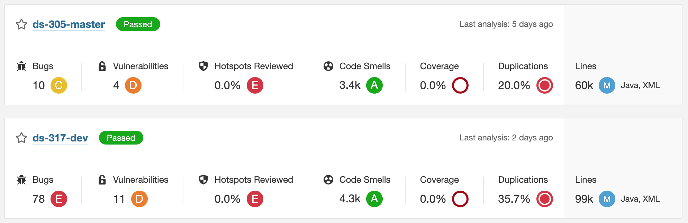

Sonar Project Overall Status Exporter
=====================================

http://localhost:9000/projects?search=ds-3&sort=duplications



```bash
$ ./sonar-exp -host http://localhost:9000 -t xxxxx -q ds-3 > ds3.csv
$ cat ds3.csv
Project,Bugs,Vulnerabilities,Hotspots Reviewed,Code Smells,Coverage,Duplications,Lines,NCLOC Language Distribution
ds-305-master,10,4,0.0,3396,0.0,20.0,60080,java=59046;xml=1034
ds-317-dev,78,11,0.0,4256,0.0,35.7,98510,java=97850;xml=660
```

| Project       | Bugs | Vulnerabilities | Hotspots Reviewed | Code Smells | Coverage | Duplications | Lines | NCLOC Language Distribution |
|:--------------|:-----|:----------------|:------------------|:------------|:---------|:-------------|:------|:----------------------------|
| ds-305-master | 10   | 4               | 0.0               | 3396        | 0.0      | 20.0         | 60080 | java=59046;xml=1034         |
| ds-317-dev    | 78   | 11              | 0.0               | 4256        | 0.0      | 35.7         | 98510 | java=97850;xml=660          |